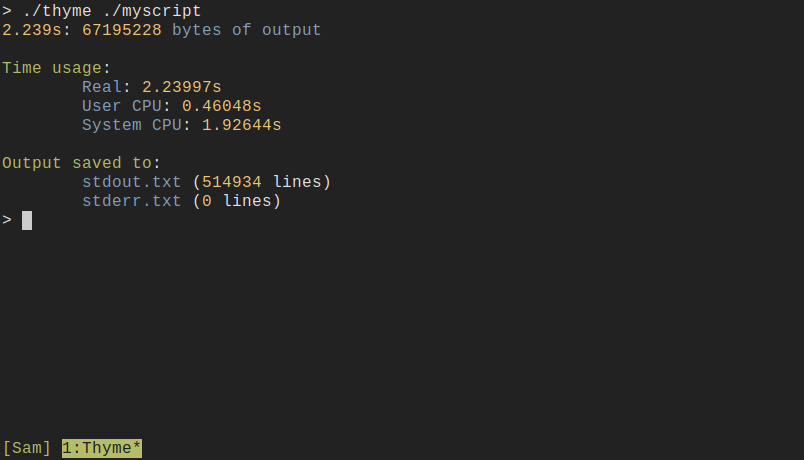
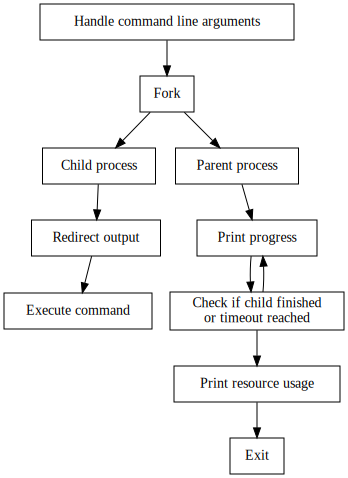

## Overview

<p align="center">
  
</p>

Note: The line that says "bytes of output" should update continuously at 60fps
while the command is running.

`thyme` is a CLI program written in C++ for timing long-running commands and
monitoring their progress. Although there is no generalized way to determine how
long a command will run, the number of bytes that are written to `stdout` can be
a good proxy for some programs. Additionally, because the program writes the
`stdout` and `stderr` streams to files, you have the added benefit of being able
to save these streams, and monitor them while the command is running with `tail
-f`.

## Features

- Real-time feedback on child process progress
- Summary of resource usage printed when program terminates
- Colorized output for better legibility
- A simple sample program for testing
- Writes output streams to files for later use or progress monitoring
- A configurable timeout to limit child process duration
- Graceful handling of `Ctrl-C`
- `stdout` and `stderr` redirection
- Zero external library dependencies

## Theory of Operation

<p align="center">
  
</p>

Most of the complexity of this program comes from the user interface code like
argument parsing, and displaying the results. Besides that, all this program
does is split into a parent and child. The child runs the process the user
specified, and the parent monitors progress until it is finished.

## Setup

Build the program with:

```
make
```

Run an optional sample program with:

```
make run
```

## Usage

```
Usage: thyme [options] command [args...]

Run a command and record its output

Options:
  -h, --help               Show this help message
  -v, --version            Show version and license information
  -o, --stdout <file>      The file to write stdout to
  -e, --stderr <file>      The file to write stderr to
  -t, --timeout <seconds>  The maximum time to run the command for

Examples:
  thyme -o stdout.txt -e stderr.txt -t 10 sleep 5
  thyme bash -c "ls"
```

## Dependencies

```
g++
make
```

## Limitations

The program counts the number of lines in the output files after it has
finished. This has possible performance implications if these files are
exceptionally large.

This program makes no attempt to verify that it is being run in an interactive
terminal. Color codes and escape sequences can and will be written even if the
output is a file.

## License

This work is licensed under the GNU General Public License version 3 (GPLv3).

[](https://www.gnu.org/licenses/gpl-3.0.en.html)
